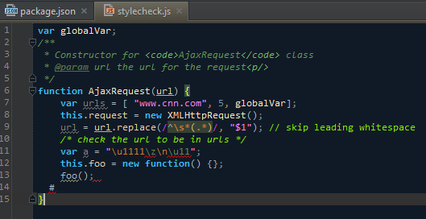

RagnarokStorm
=============

A WebStorm theme based on Ragnarok-like themes for Visual Studio

This is my first real attempt at creating a theme for WebStorm. This theme has Darcula as a base.
I have focused on colors for JavaScript (since I mostly work with node.js) and may add other parts later.

To install this theme, copy it to your WebStorm configuration folder under /config/colors and restart WebStorm.
